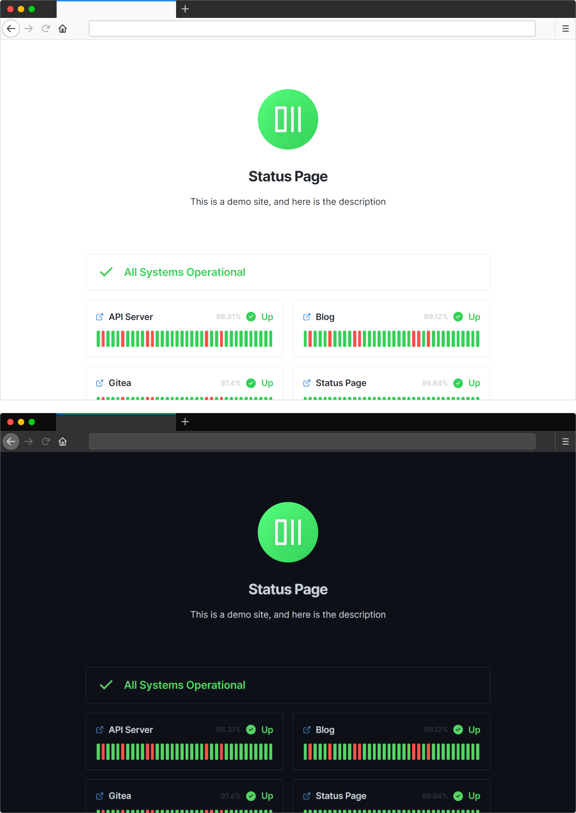

  

<h1 align="center">Status Page</h1>

一个基于 UptimeRobot API 的状态监控页面

<a href="README.md">English</a> | 中文

- [介绍](#介绍)
- [演示](#演示)
  - [预览截图](#预览截图)
- [部署](#部署)
  - [环境变量](#环境变量)
  - [部署在 Vercel 上](#部署在-vercel-上)
- [其他文档](#其他文档)
- [开源协议](#开源协议)

## 介绍

这是一个基于 UptimeRobot API 的状态监控页面。

可以通过修改项目根目录下的 `config.ts` 文件来生成自己的状态监控页面。

如果对这个的项目不满意，也可以试试 [yb/uptime-status](https://github.com/yb/uptime-status) 。

## 演示

演示地址：[https://status-page.dev.lifeni.life](https://status-page.dev.lifeni.life) 。

### 预览截图

你也可以通过自定义把页面变成下面这个样子。

## 部署

### 环境变量

你可以通过传入环境变量来代替配置文件，修改页面样式。

  
展开以查看表格

| 变量名               | 描述                                                                         | 默认值                                    | 类型                |
| -------------------- | ---------------------------------------------------------------------------- | ----------------------------------------- | ------------------- |
| `KEY`                | [你的 UptimeRobot API Key](https://uptimerobot.com/dashboard.php#mySettings) | -                                         | UptimeRobot API Key |
| `FAVICON`            | 页面图标                                                                     | `/favicon.ico`                            | URL                 |
| `PAGE_TITLE`         | 页面标题，在 `<head>` 标签中                                                 | `Status Page`                             | Text                |
| `PAGE_DESC`          | 页面描述，在 `<head>` 标签中                                                 | `A status page based on UptimeRobot API.` | Text                |
| `THEME`              | 页面主题样式                                                                 | `dark`                                    | `dark` or `light`   |
| `SHOW_HEADER_TEXT`   | 是否显示页面中间的标题                                                       | `true`                                    | Boolean             |
| `HEADER_TEXT`        | 页面中间的标题的内容                                                         | `Status Page`                             | Text                |
| `SHOW_HEADER_LOGO`   | 是否显示页面中间的 Logo                                                      | `true`                                    | Boolean             |
| `HEADER_LOGO`        | 页面中间的 Logo                                                              | `/logo.svg`                               | URL                 |
| `SHOW_HEADER`        | 是否显示 Header                                                              | `true`                                    | Boolean             |
| `SHOW_GLOBAL_STATUS` | 是否显示全局的状态栏                                                         | `true`                                    | Boolean             |
| `SHOW_FOOTER`        | 是否显示 Footer                                                              | `true`                                    | Boolean             |

也可以参考 [.env.example](/.env.example) 。

### 部署在 Vercel 上

点击下面的按钮部署。

你需要在环境变量中配置 [UptimeRobot 的 Key](https://uptimerobot.com/dashboard.php#mySettings) 。

## 其他文档

// TODO

- 如何申请 UptimeRobot API？

- 如何部署到自己的服务器上？

## 开源协议

MIT License
